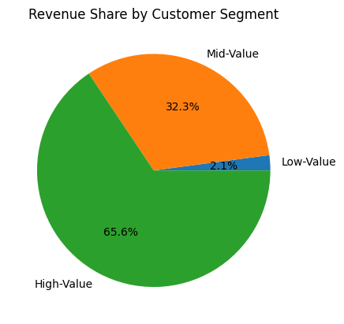
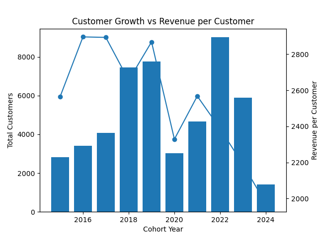
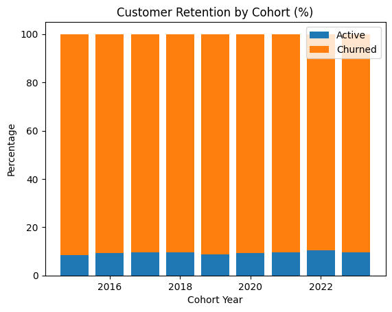

# Customer Analytics Case Study (SQL): Segmentation, Cohort Analysis & Retention

## Key Results

- 66% of revenue is generated by 25% of customers (high-value segment)
- Customer value is declining across newer cohorts (~$2.9K → ~$2.0K)
- ~90% of customers churn, indicating weak retention
- Customer return behavior is irregular, with long gaps between purchases

## Overview
This project analyzes customer behavior for an e-commerce business using SQL, focusing on customer value, retention, and revenue trends.

The goal is to understand:
- Who the most valuable customers are
- How customer value evolves over time
- How well customers are retained
- Where opportunities exist to improve revenue and retention

The analysis combines customer segmentation, cohort analysis, and retention modeling to generate actionable business insights.
## Business Questions
1. **Customer Segmentation:** Who are our most valuable customers?
2. **Cohort Analysis:** How do different customer groups generate revenue?
3. **Retention Analysis:** Which customers haven't purchased recently?
4. **Cohort Retention Behavior:** How frequently do customers return after their first purchase, and what patterns exist in long-term engagement?

## Analysis Approach

### 1. Customer Segmentation Analysis
- Categorized customers based on total lifetime value (LTV)
- Assigned customers to High, Mid, and Low-value segments
- Calculated key metrics: total revenue

🖥️ Query: [1_customer_segmentation.sql](1_customer_segmentation.sql)

**📈 Visualization:**

📊 **Key Findings:**
- High-value segment (25% of customers) drives 66% of revenue ($135.4M)
- Mid-value segment (50% of customers) generates 32% of revenue ($66.6M)
- Low-value segment (25% of customers) accounts for 2% of revenue ($4.3M)

💡 **Business Insights**
- High-Value (66% revenue): Offer premium membership program to 12,372 VIP customers, as losing one customer significantly impacts revenue
- Mid-Value (32% revenue): Create upgrade paths through personalized promotions, with potential $66.6M → $135.4M revenue opportunity
- Low-Value (2% revenue): Design re-engagement campaigns and price-sensitive promotions to increase purchase frequency

### 2. Cohort Analysis
- Tracked revenue and customer count per cohorts
- Cohorts were grouped by year of first purchase
- Analyzed customer retention at a cohort level

🖥️ Query: [2_cohort_analysis.sql](2_cohort_analysis.sql)
**📈 Visualization:**

📊 **Key Findings:**
- Revenue per customer shows an alarming decreasing trend over time
  - 2022-2024 cohorts are consistently performing worse than earlier cohorts
  - NOTE: Although net revenue is increasing, this is likely due to a larger customer base, which is not reflective of customer value

💡 **Business Insights**
- Value extracted from customers is decreasing over time and needs further investigation.
- In 2023 we saw a drop in number of customers acquired, which is concerning.
- With both lowering LTV and decreasing customer acquisition, the company is facing a potential revenue decline.

### 3. Customer Retention
🖥️ Query: [3_retention_analysis.sql](3_retention_analysis.sql)

- Identified customers at risk of churning
- Analyzed last purchase patterns
- Calculated customer-specific metrics

**📈 Visualization:**

📊 **Key Findings:**  
- Cohort churn stabilizes at ~90% after 2-3 years, indicating a predictable long-term retention pattern.  
- Retention rates are consistently low (8-10%) across all cohorts, suggesting retention issues are systemic rather than specific to certain years.  
- Newer cohorts (2022-2023) show similar churn trajectories, signaling that without intervention, future cohorts will follow the same pattern.  

💡 **Business Insights:**  
- Strengthen early engagement strategies to target the first 1-2 years with onboarding incentives, loyalty rewards, and personalized offers to improve long-term retention.  
- Re-engage high-value churned customers by focusing on targeted win-back campaigns rather than broad retention efforts, as reactivating valuable users may yield higher ROI.  
- Predict & preempt churn risk and use customer-specific warning indicators to proactively intervene with at-risk users before they lapse.

## 4. Cohort Retention (Repeat Purchase Activity)

### Objective
Analyze how customer purchasing behavior evolves over time after their first purchase by tracking repeat activity across cohorts.

---

### 🔍 Approach

- Grouped customers into cohorts based on their **first purchase month**
- Calculated **months since first purchase** for each order
- Aggregated **distinct active customers** per cohort and time interval
- Computed:
  - Customers retained per month
  - Cohort size
  - Retention rate (% of cohort active in each period)

🖥️ Query: [4_cohort_retention.sql](4_cohort_retention.sql)

**📈 Visualization:**

### 📊 Key Findings

- **Extremely low short-term retention:**  
  Most cohorts show very low repeat purchases in month 1 (~0.3%–0.7%)

- **Irregular return behavior:**  
  Customers do not return consistently month-to-month — activity appears in scattered later months

- **Long-tail reactivation:**  
  Some customers return even after 2–5+ years (e.g., month 60+), indicating long purchase cycles

---

### 💡 Business Insights

- **Early churn is critical:**  
  The biggest drop happens immediately after the first purchase → onboarding and early engagement are key

- **Customers are not habitual buyers:**  
  The business likely operates in a **low-frequency purchase category**

- **Reactivation opportunities exist:**  
  Since customers return after long gaps, targeted re-engagement campaigns could unlock value

---

### ⚠️ Note on Interpretation

This analysis measures:

👉 **Exact-month repeat activity** (customers active in each specific month after first purchase)

This differs from cumulative retention and results in a **sparse retention pattern**, reflecting irregular customer behavior.

## Strategic Recommendations

### 1. Focus on High-Value Customers
- High-value customers generate ~66% of total revenue
- Prioritize retention through:
  - VIP programs
  - exclusive offers
  - personalized experiences
- Losing a small number of these customers has a significant revenue impact

---

### 2. Improve Early Customer Retention
- ~90% of customers churn after initial engagement
- Most drop-off occurs within the first 1–2 months
- Recommended actions:
  - onboarding campaigns
  - first-purchase incentives
  - targeted follow-ups within 30–60 days

---

### 3. Increase Customer Value (Not Just Volume)
- Customer acquisition is increasing, but revenue per customer is declining
- Focus on:
  - upselling and cross-selling strategies
  - improving pricing and product positioning
  - targeting higher-quality customer segments

---

### 4. Leverage Reactivation Opportunities
- Customers return even after long gaps (12–60+ months)
- Indicates potential for re-engagement
- Recommended actions:
  - win-back campaigns
  - email marketing targeting inactive users
  - personalized offers based on past behavior

---

### 5. Investigate Declining Cohort Performance
- Newer cohorts (2022–2024) generate less revenue per customer
- Potential causes:
  - weaker acquisition channels
  - changes in customer profile
  - reduced product value perception
- Further analysis recommended on acquisition sources and customer demographics

## Technical Details
- **Database:** PostgreSQL
- **Analysis Tools:** PostgreSQL, DBeaver, PGadmin
- **Visualization:** ChatGPT